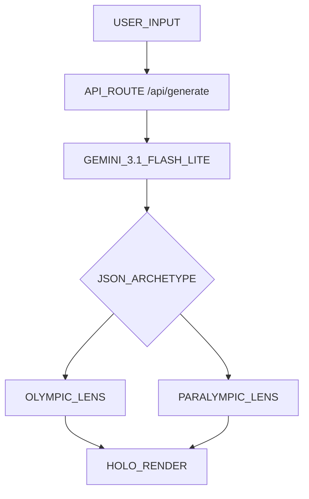

<table width="100%" border="0">
  <tr>
    <td width="100%" align="center">
       
      <code>[ THE ARCHIVE // HOLO-TYPE-V1 ]</code>
      <h1>HOLO-TYPE</h1>
      
<strong>Where Team USA's legacy meets the future of generative AI.</strong>

      <code>⌜ REDEFINE YOUR POTENTIAL ⌟</code>
    </td>
  </tr>
</table>

[**EXPERIENCE_HOLO_TYPE**](https://holo-type--holo-type.us-east4.hosted.app/) • [**PROJECT_JOURNEY**](https://devpost.com/software/holo-type) • [**TECHNICAL_ARCH**](#-system-architecture)

---

> `⚡ "120 years of excellence. Two lenses of greatness. One archetype: Yours."`
> 
> `A submission for the Team USA x Google Cloud "Vibe Code for Gold" hackathon.`

---

### ⎔ THE_LEGACY_PALETTE
| ⬢ **OLD GLORY BLUE** | ⬢ **OLD GLORY RED** | ⬢ **WHITE** | ⬢ **MEDAL GOLD** | ⬢ **HOLO SILVER** |
| :---: | :---: | :---: | :---: | :---: |
| `#0A1F44` | `#E4002B` | `#FFFFFF` | `#C5A059` | `#C0C0C0` |

---

> [!IMPORTANT]
> **JUDGE_&_FAN_QUICKSTART**
>
> 1. **NAVIGATE:** Open the [Live Experience](https://holo-type--holo-type.us-east4.hosted.app/).
> 2. **CHOOSE:** Select the **Morning Sprinter** preset or enter your own daily routine.
> 3. **GENERATE:** Click **Run Historical Alignment** to invoke Gemini 3.1.
> 4. **DISCOVER:** Toggle between the **Olympic** and **Paralympic** card faces.

---

## ✦ THE_MISSION

Holo-Type was built to help every fan see themselves in the DNA of Team USA. By analyzing the way you move, think, and lead, our AI maps your profile to an athlete archetype grounded in over a century of Olympic and Paralympic data.

### ⌜ SYSTEM_INNOVATIONS ⌟

- **⬡ ARCHIVAL GROUNDING**: We've distilled 1.2MB of historical Team USA results to ensure your archetype is rooted in reality.
- **⬡ HOLOGRAPHIC PHYSICS**: Experience a "living" interface with 3D physics and iridescent shaders that react to your movement.
- **⬡ PARITY BY DESIGN**: Paralympic athletes aren't a secondary mode—they are a mandatory part of every generation's DNA.
- **⬡ GEOMETRIC STATS**: Your performance traits are visualized through dynamic radar shapes, unique to your alignment.
- **⬡ GLOBAL TRANSMISSION**: Share your potential through high-fidelity, 9:16 and 1:1 posters designed for social impact.

---

## ✦ PARITY: OUR_CORE_PRINCIPLE

At Holo-Type, we believe parity is a foundation, not a feature. In traditional sports media, Paralympic coverage is often separate. We've changed the architecture: **every single generation request is required to produce both Olympic and Paralympic narratives.**

> `GREATNESS HAS NO FOOTNOTES.`

This ensures that every fan witnesses their potential through both lenses with equal depth, artistry, and technical precision.

---

## ✦ TECHNICAL_FOUNDATION

### INTELLIGENT_GENERATION
Powered by **Gemini 3.1 Flash Lite**, we use advanced reasoning (`ThinkingLevel.MEDIUM`) to synthesize user input against 120 years of archival data. The result is a high-precision JSON payload delivered in a single inference call.

### PHYSICAL_FIDELITY
The interface feels like a physical artifact, not just a webpage.
- **Physics**: Heavy "Liquid" momentum (`Mass: 1.2`, `Damping: 40`).
- **Shaders**: Layered foil effects using `Color-Dodge` and `Soft-Light` blending.
- **Stability**: Flat-stack rendering ensures 3D tilt without visual distortion.

---

## ✦ THE_PROMPT_LIBRARY
`START YOUR ALIGNMENT VOYAGE:`

- ✦ **MORNING SPRINTER**: "Fast decisions, high energy, first one done."
- ✦ **STEADY PACER**: "Consistent momentum over long durations."
- ✦ **TEAM CAPTAIN**: "Organizing people and reading the room."
- ✦ **PRECISION CRAFTSMAN**: "Meticulous detail and manual craft."
- ✦ **ENDURANCE RUNNER**: "Patience is the edge. Outlasting all."
- ✦ **ADAPTIVE STRATEGIST**: "Reading the situation and improvising."

---

## ✦ SYSTEM_ARCHITECTURE

---

## ✦ JUDGING_CRITERIA_MATRIX

| CRITERION | MISSION_RESPONSE |
| :--- | :--- |
| **IMPACT** | Universal visibility through architectural parity. Fans find their place in the legacy. |
| **TECH_DEPTH** | Gemini 3.1 integration, historical data grounding, and Next.js 16/React 19 stack. |
| **PRESENTATION** | Premium holographic UI with high-performance 3D shaders and liquid physics. |

---

## ✦ DATA_INTEGRITY_REPORT

| COMPONENT | STATUS | NOTES |
| :--- | :--- | :--- |
| **HISTORICAL_DNA** | `AUTHENTIC` | Rooted in 120 years of Team USA achievement data. |
| **AI_REASONING** | `REAL-TIME` | Dynamic generation via Gemini 3.1 Flash Lite. |
| **PARITY_CHECK** | `MANDATORY` | Dual-lens narratives enforced at the schema level. |
| **RARITY_ENGINE** | `DYNAMIC` | Calculated based on the uniqueness of the alignment. |
| **IDENTITY_PROT** | `REDACTED` | NIL compliant—athlete names are never used. |

---

⌜ ARCHIVE_ACCESS_&_SETUP ⌟

### INSTALLATION
1. Clone the repository.
2. Configure `.env.local` with your `GEMINI_API_KEY`.
3. Execute `npm install` && `npm run dev`.

### DEPLOYMENT_SPEC
Hosted on **Firebase App Hosting** in `us-east4`. Secret management via **Google Cloud Secret Manager**.

---

## ✦ ROADMAP
- **[ ]** TRANSMIT_LIVE: Unique shareable alignment links.
- **[ ]** REALTIME_TRIAL: Integration with current trial result streams.
- **[ ]** HAPTIC_TOUCH: Physical tilt feedback for mobile artifacts.

---

## 📄 LICENSE
Apache-2.0

