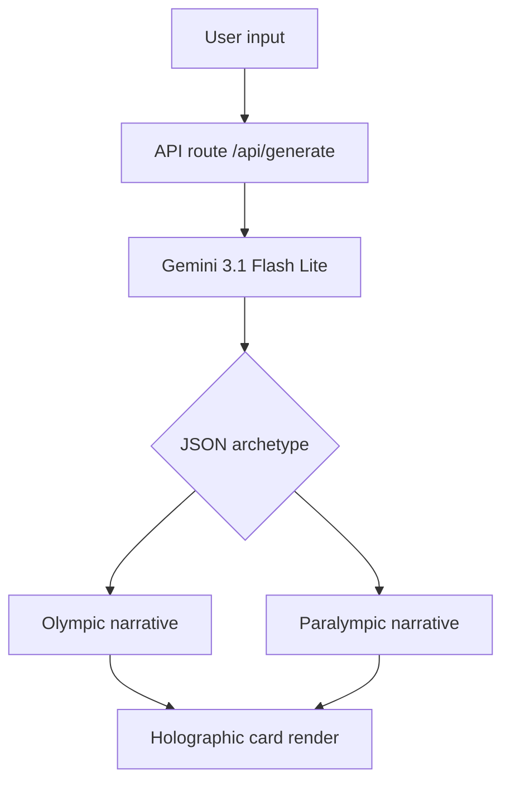

# Holo-Type

Generate Team USA athlete archetypes from your daily routine. Built on Gemini 3.1, grounded in 120 years of Olympedia data. A submission for the Team USA x Google Cloud "Vibe Code for Gold" hackathon.

[Live demo](https://holo-type--holo-type.us-east4.hosted.app/) · [Devpost](https://devpost.com/software/holo-type) · [Demo Video](https://youtu.be/-FlPM1UwPA4)

## What it does

Pick a movement preset or describe your daily work style. The backend sends that context to `gemini-3.1-flash-lite` with `ThinkingLevel.MEDIUM` and a strict JSON schema. The model returns an archetype with stats, rarity, and two narratives, Olympic and Paralympic. The frontend renders it as a 3D holographic card with iridescent shaders and pointer-tracked physics.

No athlete names, likenesses, or individual scores. NIL-compliant.

## Parity

Every generation request returns both Olympic and Paralympic narratives. The schema requires it. Same UI, same depth, same shaders. Not a separate category.

## Quickstart for judges

1. Open the [live experience](https://holo-type--holo-type.us-east4.hosted.app/).
2. Pick the **Morning Sprinter** preset, or describe your own routine.
3. Click **Run Historical Alignment**.
4. Flip between the Olympic and Paralympic card faces.

## Prompt presets

- **Morning Sprinter**: Fast decisions, high energy, first one done.
- **Steady Pacer**: Consistent momentum over long durations.
- **Team Captain**: Organizing people and reading the room.
- **Precision Craftsman**: Meticulous detail and manual craft.
- **Endurance Runner**: Patience is the edge. Outlasting all.
- **Adaptive Strategist**: Reading the situation and improvising.

## Architecture

## Stack

| Layer     | Tech                                      |
| --------- | ----------------------------------------- |
| Framework | Next.js 16 (App Router), React 19         |
| Styling   | Tailwind CSS 4                            |
| Animation | Framer Motion 12                          |
| AI        | Gemini 3.1 Flash Lite via `@google/genai` |
| Hosting   | Firebase App Hosting (`us-east4`)         |
| Secrets   | Google Cloud Secret Manager               |
| Export    | `html-to-image` for 9:16 and 1:1 posters  |

## Card rendering

The cards feel physical without breaking on steep tilt angles. Three things make that work:

- **Flat-stack architecture.** All card content renders flat on the surface. No Z-offsets to fight with the 3D tilt.
- **Liquid physics.** Framer Motion with mass 1.2 and damping 40. Heavy momentum, no overshoot.
- **Layered iridescent CSS.** `mix-blend-color-dodge`, `overlay`, and `soft-light` blending, with pointer-tracked gradients for depth.

## Data integrity

| Component           | Status    | Notes                                                    |
| ------------------- | --------- | -------------------------------------------------------- |
| Historical data     | Authentic | Aggregated from 120 years of Team USA Olympedia results. |
| AI reasoning        | Real-time | Single Gemini 3.1 Flash Lite inference per generation.   |
| Parity check        | Mandatory | Both narratives enforced at the schema level.            |
| Rarity engine       | Dynamic   | Calculated from the uniqueness of the alignment.         |
| Identity protection | Redacted  | NIL-compliant. No athlete names or likenesses.           |

## Judging criteria

| Criterion    | Response                                                                                                             |
| ------------ | -------------------------------------------------------------------------------------------------------------------- |
| Impact       | Architectural parity puts Olympic and Paralympic narratives on equal footing by default, in every generation.        |
| Tech depth   | Gemini 3.1 with structured JSON output, grounded on a sanitized 120-year Olympedia dataset. Next.js 16 and React 19. |
| Presentation | 3D holographic cards with pointer-tracked iridescent shaders and tuned liquid physics.                               |

## Setup

1. Clone the repo.
2. Add `GEMINI_API_KEY` to `.env.local`.
3. Run `npm install && npm run dev`.

## Color palette

| Old Glory Blue | Old Glory Red | White     | Medal Gold | Holo Silver |
| -------------- | ------------- | --------- | ---------- | ----------- |
| `#0A1F44`      | `#E4002B`     | `#FFFFFF` | `#C5A059`  | `#C0C0C0`   |

## Roadmap

- [ ] Shareable alignment links.
- [ ] Live trial result stream integration.
- [ ] Haptic tilt feedback on mobile.

## License

Apache-2.0
