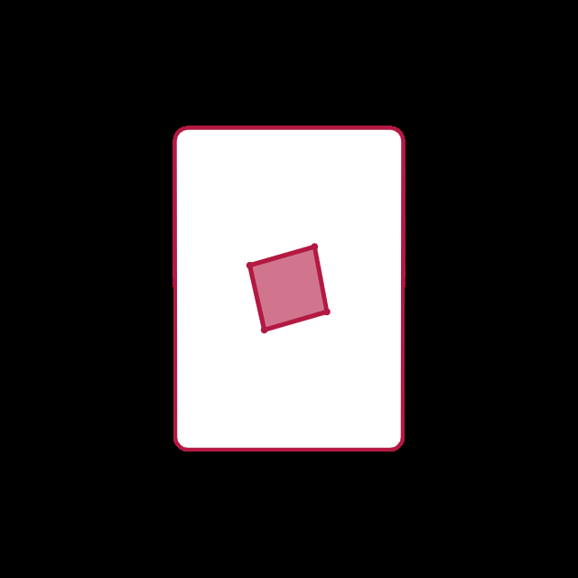
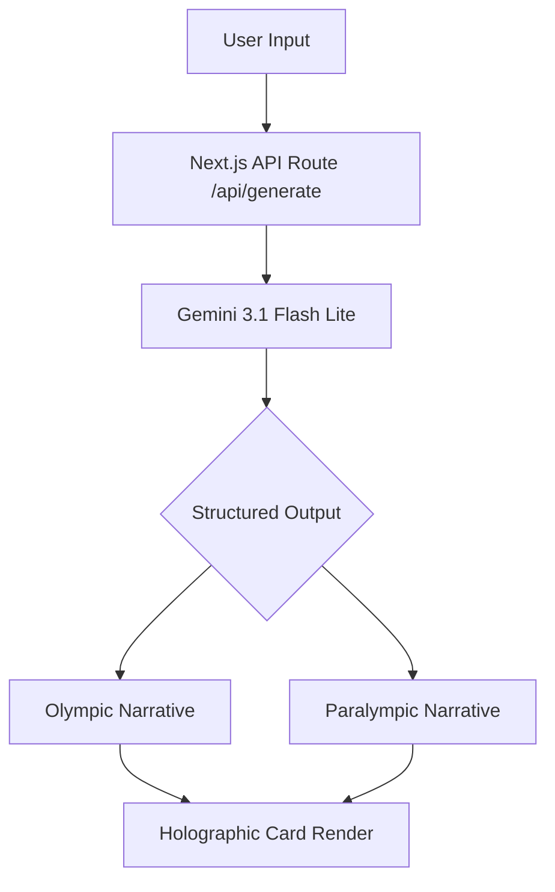

<table width="100%" border="0">
  <tr>
    <td width="20%" align="left">
      
    </td>
    <td width="60%" align="center">
      <h1>Holo-Type</h1>
      
<strong>A holographic athlete archetype generator grounded in 120 years of Team USA history.</strong>

    </td>
    <td width="20%" align="right">
      
    </td>
  </tr>
</table>

[Live Demo](https://holo-type--holo-type.us-east4.hosted.app/) | [Devpost](https://devpost.com/software/holo-type) | [Demo Video (coming soon)](#) | [Architecture](#architecture)

---

*(Red, White, and Blue theme enforced)*

> This project is a submission for the Team USA x Google Cloud "Vibe Code for Gold" hackathon, addressing the Athlete Archetypes challenge.

---

> [!IMPORTANT]
> **Judge Quickstart**
>
> 1. Visit the [Live Demo](https://holo-type--holo-type.us-east4.hosted.app/).
> 2. Select the **Morning Sprinter** preset.
> 3. Click **Run Historical Alignment**.
> 4. Toggle between the **Olympic** and **Paralympic** lenses to see the parity implementation.
> 5. Enter a custom bio like "I am a 6'4" software engineer who cycles 40 miles every weekend" to see real-time historical grounding.

## What it does

Holo-Type analyzes a user's daily movement patterns and work style to identify their alignment with Team USA's legacy of excellence. Using the Gemini 3.1 Flash Lite model, it maps user descriptions to conceptual athlete archetypes. Each result is presented as an interactive holographic card that reveals distinct narratives for both Olympic and Paralympic disciplines.

## Why it exists

Paralympic parity is the core thesis of Holo-Type. In many sports applications, Paralympic athletes are treated as an afterthought or a separate category. Holo-Type enforces parity at the architectural level. Every generation request is required to produce a dual-lens narrative. This ensures that every user sees their potential through both lenses with equal prominence and depth.

## What's real vs. simulated

| Layer           | Status           | Notes                                                                                    |
| :-------------- | :--------------- | :--------------------------------------------------------------------------------------- |
| Historical Data | **Real**         | Grounded in 50+ samples from a 120-year Team USA dataset (`data/team_usa_summary.json`). |
| AI Generation   | **Real**         | Uses `gemini-3.1-flash-lite` with structured JSON output and `ThinkingLevel.MEDIUM`.     |
| Parity          | **Real**         | Forced schema requirement for both Olympic and Paralympic narratives in a single call.   |
| Rarity          | **AI-Generated** | The model determines rarity based on the uniqueness of the alignment.                    |
| Athlete Names   | **Simulated**    | Athlete names are excluded to comply with NIL restrictions. All titles are conceptual.   |

## Try these prompts

- **Morning Sprinter**: Fast decisions, high energy, first one done.
- **Steady Pacer**: Consistent momentum over long durations.
- **Team Captain**: Organizing people and reading the room.
- **Precision Craftsman**: Meticulous detail and manual craft.
- **Endurance Runner**: Patience is the edge. Outlasting all.
- **Adaptive Strategist**: Reading the situation and improvising.

## Architecture

Parity is enforced at the model layer. The AI is instructed to return a single JSON object containing both narratives. This architectural choice prevents "secondary lens" bias. The UI simply flips the card to reveal the alternative view.

## How it maps to the judging criteria

| Criterion                | Score Weight | Project Answer                                                                                                                                                                                             |
| :----------------------- | :----------: | :--------------------------------------------------------------------------------------------------------------------------------------------------------------------------------------------------------- |
| **Impact**               |     40%      | Lets fans see themselves in Team USA's legacy through both Olympic and Paralympic lenses with equal depth. Parity is enforced as a mandatory architectural constraint, not a separate mode.               |
| **Technical Depth**      |     30%      | Single Gemini 3 structured-output call returns both narratives, with `ThinkingLevel.MEDIUM` reasoning and 1.2MB of 120-year Team USA historical context grounding the alignment.                           |
| **Presentation Quality** |     30%      | Features a high-fidelity holographic UI with 3D physics and iridescent foil shaders.                                                                                                                       |

## Tech stack

Holo-Type is built with Next.js 16.2.5, React 19.2.4, Tailwind CSS 4, Motion 12.38.0, and the Google GenAI SDK 2.0.0.

## Deployment

Holo-Type is deployed via Firebase App Hosting, which orchestrates Google Cloud Run, Cloud Build, and Cloud CDN. The application runs in the `us-east4` region. The Gemini API key is securely managed through Cloud Secret Manager and injected into the build environment via `apphosting.yaml`.

## AI usage and safety

The application utilizes the `gemini-3.1-flash-lite` model. All AI invocations happen server-side to protect API credentials and ensure response validation. The system prompt enforces conditional language to avoid performance guarantees. User input is whitespace-normalized and wrapped in delimiter tokens before being injected into the prompt, which reduces prompt-injection surface area. No personally identifiable information is requested, stored, or processed.

Local development

**Prerequisites**

- Node.js 22+
- A Google AI Studio API Key

**Setup**

1. Clone the repository.
2. Create a `.env.local` file with `GEMINI_API_KEY=your_key_here`.
3. Install dependencies: `npm install`.
4. Run the development server: `npm run dev`.

**Available Scripts**

- `npm run dev`: Start development server.
- `npm run build`: Build the production application.
- `npm run lint`: Run ESLint.

For more detailed conventions, see [GEMINI.md](./GEMINI.md).

## What's next

- **Social Transmission**: Generate unique URLs for specific alignment vectors.
- **Expanded Grounding**: Incorporate real-time Team USA trial results.
- **Haptic Feedback**: Mobile-optimized physical tilt interactions.

## License

Apache-2.0
